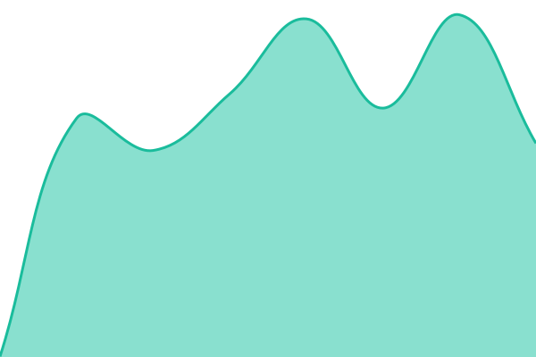
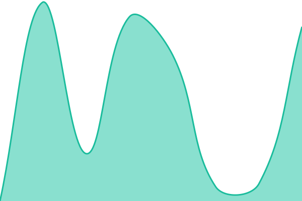

# [📈 Live Status](https://uptime.futzs.com): <!--live status--> **🟩 All systems operational**

This repository contains the open-source uptime monitor and status page for [FutzsLab](https://futzs.com), powered by [Upptime](https://github.com/upptime/upptime).

With [Upptime](https://upptime.js.org), you can get your own unlimited and free uptime monitor and status page, powered entirely by a GitHub repository. We use [Issues](https://github.com/futzslab/upptime/issues) as incident reports, [Actions](https://github.com/futzslab/upptime/actions) as uptime monitors, and [Pages](https://uptime.futzs.com) for the status page.

<!--start: status pages-->
<!-- This summary is generated by Upptime (https://github.com/upptime/upptime) -->
<!-- Do not edit this manually, your changes will be overwritten -->
<!-- prettier-ignore -->
| URL | Status | History | Response Time | Uptime |
| --- | ------ | ------- | ------------- | ------ |
|  [Vaultwarden](https://vaultwarden.futzs.com/alive) | 🟩 Up | [vaultwarden.yml](https://github.com/futzslab/upptime/commits/HEAD/history/vaultwarden.yml) | 

 591ms
     
 | 

<a href="https://uptime.futzs.com/history/vaultwarden">100.00%</a>
    

|  [Redmine (mpsts)](https://mpsts.futzs.com) | 🟩 Up | [redmine-mpsts.yml](https://github.com/futzslab/upptime/commits/HEAD/history/redmine-mpsts.yml) | 

 722ms
     
 | 

<a href="https://uptime.futzs.com/history/redmine-mpsts">100.00%</a>
    

|  [QuickReply](https://quickreply.futzs.com) | 🟩 Up | [quick-reply.yml](https://github.com/futzslab/upptime/commits/HEAD/history/quick-reply.yml) | 

 577ms
     
 | 

<a href="https://uptime.futzs.com/history/quick-reply">100.00%</a>
    

|  [RCM](https://rcm.futzs.com) | 🟩 Up | [rcm.yml](https://github.com/futzslab/upptime/commits/HEAD/history/rcm.yml) | 

 739ms
     
 | 

<a href="https://uptime.futzs.com/history/rcm">100.00%</a>
    

|  [Umami](https://umami.futzs.com/api/heartbeat) | 🟩 Up | [umami.yml](https://github.com/futzslab/upptime/commits/HEAD/history/umami.yml) | 

 614ms
     
 | 

<a href="https://uptime.futzs.com/history/umami">100.00%</a>
    

|  [futzs.com (GitHub Pages)](https://futzs.com) | 🟩 Up | [futzs-com-git-hub-pages.yml](https://github.com/futzslab/upptime/commits/HEAD/history/futzs-com-git-hub-pages.yml) | 

 144ms
     
 | 

<a href="https://uptime.futzs.com/history/futzs-com-git-hub-pages">100.00%</a>
    

|  [SK](https://sergekoudoro.com) | 🟩 Up | [sk.yml](https://github.com/futzslab/upptime/commits/HEAD/history/sk.yml) | 

 129ms
     
 | 

<a href="https://uptime.futzs.com/history/sk">100.00%</a>
    

|  [shooter diary](https://shooterdiary.sergekoudoro.com/) | 🟩 Up | [shooter-diary.yml](https://github.com/futzslab/upptime/commits/HEAD/history/shooter-diary.yml) | 

 154ms
     
 | 

<a href="https://uptime.futzs.com/history/shooter-diary">100.00%</a>
    

|  [icalsync (Fly.io)](https://icalsync.futzs.com) | 🟩 Up | [icalsync-fly-io.yml](https://github.com/futzslab/upptime/commits/HEAD/history/icalsync-fly-io.yml) | 

 485ms
     
 | 

<a href="https://uptime.futzs.com/history/icalsync-fly-io">100.00%</a>
    

<!--end: status pages-->

[**Visit our status website →**](https://uptime.futzs.com)

## 📄 License

- Powered by: [Upptime](https://github.com/upptime/upptime)
- Code: [MIT](./LICENSE) © [Anand Chowdhary](https://anandchowdhary.com)
- Data in the `./history` directory: [Open Database License](https://opendatacommons.org/licenses/odbl/1-0/)
